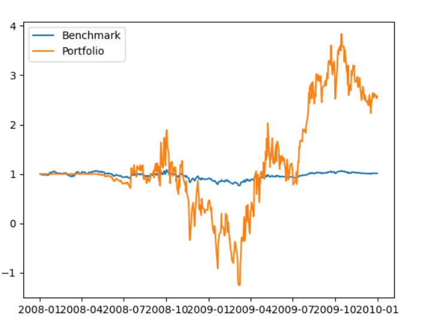
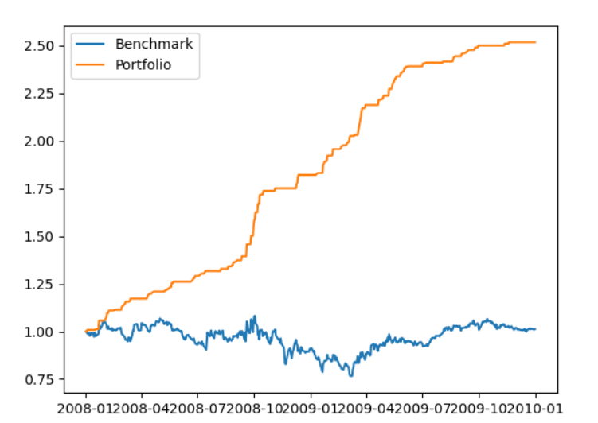

## Introduction
Quantitative trading is a revolutionary tools for the financial area. People could use it to trade efficiently and accurately. In order to understand the power behind that, we could simulate it by using the historical trading data from Yahoo finance. We could build our portfolio by using different technique indicators and use the dicision-tree model to fit the data and predict the action we should made at certain spot. In the end, we will visualize our profit and compare to the benchmark.

## Dependencies
- Numpy
- Pandas
- Matplotlib

## Getting Started
### Extracting and cleaning the data
Yahoo finance is a good source to download the trading data. All we need to do is find the company we like and click the download button. Then, we could use the pandas to get the data import to python. We will use SPY as a benchmark to get trading days, and settled a series of handwritten function to extract the metric from csv such as Open, Close, Adj Close and Volume. We will use those data to construct our own portfolio.

### Build your own portfolio 
There are lots of well-established technical indicators online which could help us to build the portfolio. I used several technical indicators in here such as On-Balance Volume (OBV), Stochastic Oscillator, Accumulation/Distribution Indicator (A/D), Price Rate Of Change Indicator (ROC). We could set a benchmark(hold 1000 shares of stock until the end of period) to compare the profit/return of our portfolio. Here is the comparison between the performance of my portfoilo and the benchmark.

### How could we improve it?
Creating a portfolio is not a easy thing. It is pretty hard for a beginner like me to set each coefficients correctly. Like the plot showed above, I didn't set the limit of volume for short selling/long stock. We can see that my portfolio was under deficit in almost one year. This is certainly unacceptable for most of the investors. However, thanks for the data science. We could use various kinds of model to help us made the right decision on trading. I wrote a simple version of decision tree model by using the numpy package. 

### Predict the action by using the decision-tree
By using the decision-tree model, we could predict whether we should sell/buy or hold.

## Conclusion
We might see a big 

